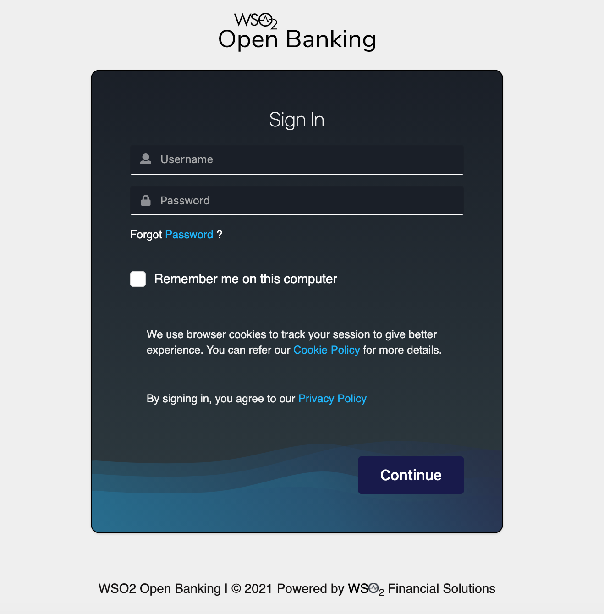
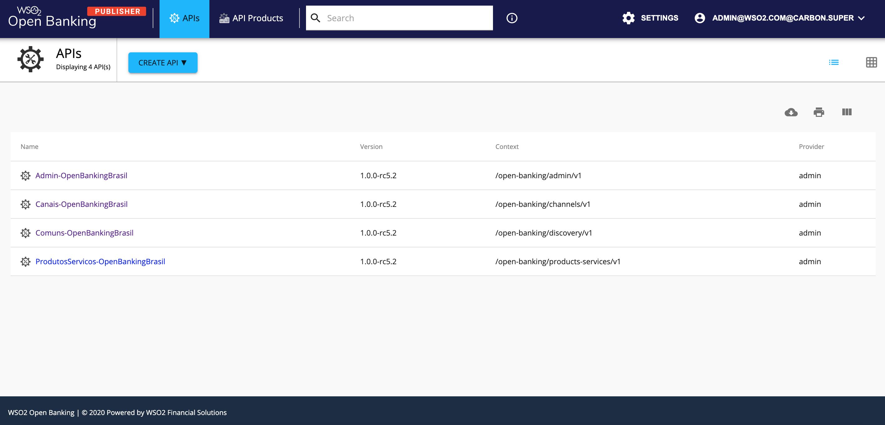
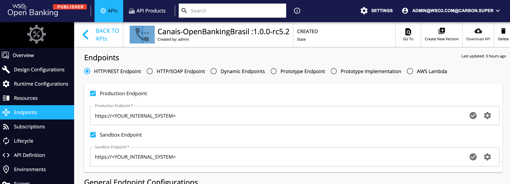

# WSO2 Open Banking - Importando as APIs do OpenBanking Brasil para o gateway

Todas as definições de APIs foram obtidas do portal oficial do open banking brasil: https://openbanking-brasil.github.io/areadesenvolvedor/

Saiba mais sobre a plataforma WSO2 Open Banking em: https://openbanking.wso2.com/

---------
## Passo-a-Passo

### Instalação da CLI apictl
Ferramenta de apoio ao desenvolvedor para a importação de APIs através de linha de comando.

Siga este [procedimento](https://apim.docs.wso2.com/en/3.1.0/learn/api-controller/getting-started-with-wso2-api-controller/#check-the-version-of-the-ctl) para realizar a instalação e a configuaração da CLI.

**Note:** O procedimento assumirá que já existe um ambiente do WSO2 API Manager instalado e em execução.


### Importando as APIs

``` 
apictl import-api -e <AMBIENTE> -f admin-apis-ob-brasil/ -k

Output:
Successfully imported API
``` 

``` 
apictl import-api -e <AMBIENTE> -f channels-apis-ob-brasil/ -k

Output:
Successfully imported API
``` 
``` 
apictl import-api -e <AMBIENTE> -f commons-apis-ob-brasil/ -k

Output:
Successfully imported API
``` 
``` 
apictl import-api -e <AMBIENTE> -f products-services-apis-ob-brasil/ -k

Output:
Successfully imported API
``` 

### Reailze o Login na console administrativa


### Visualizando as APIs criadas



### Realize os ajustes nos endpoints para o correto roteamento das APIs

  
  
